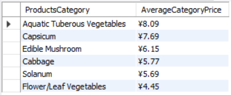

# Analyzing Supermarket Database with SQL

## Table of Contents

+ [Analyzing Supermarket Database with SQL](#analyzing-supermarket-database-with-sql)
+ [Table of Contents](#table-of-contents)
+ [Introduction](#introduction)
  + [Business Questions](#business-questions)
  + [About Database](#about-database)
+ [Data Cleaning](#data-cleaning)
+ [Data Analysis](#data-analysis)
  + [Loss_Rates](#loss_rates)
  + [Wholesale_Prices](#wholesale_prices)
  + [Sales](#sales)

## Introduction

In this SQL project, we will analyze a supermarket database, applying essential SQL concepts such as basic queries, aggregation, date and time functions, join operations, subqueries, and window functions.

### Business Questions

These are SQL analysis business questions for this project and they will be categorized and addressed according to their respective concepts.

1. Basic Queries
    + Retrieve all product names and their categories from the Products table.
    + List all items with a loss rate greater than 5% from the Loss_Rates table.
    + Find products listed in the Sales table that do not exist in the Products table.
1. Aggregation Functions
    + Calculate the average wholesale price of each category of products.
    + Find the total sales for each item in the Sales table.
    + Display the item name along with its loss rate.
1. Date and Time Functions
    + List the total sales quantity for each month.
    + Find the product that had the highest sales in terms of quantity on a given date.
1. Join Operations
    + Determine the average loss rate for each category.
    + Find the total sales for each category of products.
1. Subqueries
    + Identify products that have a higher loss rate than the average loss rate of their respective category.
    + List the top 3 products with the highest sales in each category.
1. Window Functions
    + Calculate the running total of sales for each product over time.
    + Identify the top-selling product (based on the total quantity sold) in each category.
1. Complex Queries
    + Calculate the month-over-month growth rate in sales for each product category.
    + Find the day with the highest total sales for each product and the corresponding sale amount.
    + For each category, indicate whether the total sales quantity in the most recent month increased or decreased compared to the previous month. Use 'Up', 'Down', or 'Stable' to represent the trend.
    + Calculate the average wholesale price for each category and the percentage variation from the overall average wholesale price across all categories.

### About Database

You could find the dataset that used in this database originates from [supermarket-sales-data](www.kaggle.com/datasets/yapwh1208/supermarket-sales-data).

The dataset consists of four interconnected tables:

+ Products: Holds unique records for each product, including an identifier, item code, name, and category details.
+ Sales: Records individual sales transactions, detailing the product sold (linked by item code), the date and time of sale, quantity, unit sale price, type of transaction (sale or return), and any discounts applied.
+ Prices: Tracks the wholesale prices of products over time, identified by the item code and date.
+ Loss Rates: Records the loss rates of products, identified by the item code and name.

#### Database Relationship


## Data Cleaning

From the business questions, we can see only two questions are related to ensuring data quality.

Which are:

+ Retrieve all product names and their categories from the Products table
+ Find products listed in the Sales table that do not exist in the Products table.

### Retrieve all product names and their categories from the Products table

```sql

SELECT
    DISTINCT item_name AS ProductName,
    category_name AS CategoryName
FROM products
ORDER BY item_name ASC;

```


For csv file you can find it [here](output/csv/data_cleaning_1.csv).

### Find products listed in the Sales table that do not exist in the Products table

```sql

SELECT
    a.item_code
FROM sales a
LEFT JOIN products b
    ON a.item_code = b.item_code
WHERE b.item_code IS NULL;

```


For csv file you can find it [here](output/csv/data_cleaning_2.csv).

#### Data Cleaning Summary

+ There are 248 rows of products with its category in the Products table.
+ All products listed in the Sales table exist in the Products table.

## Data Analysis

In this analysis, we will answer the business questions. The business questions will be categorized by table its analyzed.

Which Are:

1. Loss_Rates
    + Display the item name along with its loss rate.
    + List all items with a loss rate greater than 5% from the Loss_Rates table.
    + Determine the average loss rate for each category.
    + Identify products that have a higher loss rate than the average loss rate of their respective category.
1. Wholesale_Prices
    + Calculate the average wholesale price of each category of products.
    + Calculate the average wholesale price for each category and the percentage variation from the overall average wholesale price across all categories.
1. Sales
    + Find the total sales for each item in the Sales table.
    + Find the total sales for each category of products.
    + List the top 3 products with the highest sales in each category.
    + Identify the top-selling product (based on the total quantity sold) in each category.
    + Find the day with the highest total sales for each product and the corresponding sale amount.
    + List the total sales quantity for each month.
    + Find the product that had the highest sales in terms of quantity on a given date.
    + Calculate the running total of sales for each product over time.
    + Calculate the month-over-month growth rate in sales for each product category.
    + For each category, indicate whether the total sales quantity in the most recent month increased or decreased compared to the previous month. Use 'Up', 'Down', or 'Stable' to represent the trend.

### Loss_Rates

#### Display the item name along with its loss rate

```sql

SELECT
    item_name AS ProductName,
    CONCAT(ROUND(AVG(loss_rate), 2), '%') AS LossRate
FROM loss_rates
GROUP BY item_name
ORDER BY ROUND(AVG(loss_rate), 2) DESC;

```


For csv file you can find it [here](output/csv/loss_rates_1.csv).

#### List all items with a loss rate greater than average loss rate from the Loss_Rates table

```sql

SELECT
    item_name AS ProductName,
    CONCAT(loss_rate, '%') AS ProductLossRate
FROM loss_rates
WHERE loss_rate > (
    SELECT
        ROUND(AVG(loss_rate), 2) AS AverageLossRate
    FROM loss_rates
)
ORDER BY item_name ASC;

```


For csv file you can find it [here](output/csv/loss_rates_2.csv).

#### Determine the average loss rate for each category

```sql

SELECT
    b.category_name AS ProductsCategory,
    CONCAT(ROUND(AVG(loss_rate), 2), '%') AS AverageCategoryLossRate
FROM loss_rates a
LEFT JOIN products b
    ON a.item_code = b. item_code
GROUP BY b.category_name
ORDER BY ROUND(AVG(loss_rate), 2) DESC;

```


For csv file you can find it [here](output/csv/loss_rates_3.csv).

#### Identify products that have a higher loss rate than the average loss rate of their respective category

```sql

SELECT
    b.category_name AS ProductsCategory,
    a.item_name AS ProductsName,
    CONCAT(ROUND(AVG(loss_rate), 2), '%') AS ProductsLossRate
FROM loss_rates a
LEFT JOIN products b
    ON a.item_code = b.item_code
LEFT JOIN (
    SELECT
        a.category_name AS ProductsCategory,
        ROUND(AVG(b.loss_rate), 2) AS AverageCategoryLossRate
    FROM products a
    LEFT JOIN loss_rates b
        ON a.item_code = b.item_code
    GROUP BY ProductsCategory
) AS c
    ON b.category_name = c.ProductsCategory
WHERE a.loss_rate > AverageCategoryLossRate
GROUP BY b.category_name, a.item_name
ORDER BY ROUND(AVG(loss_rate), 2) DESC;

```


For csv file you can find it [here](output/csv/loss_rates_4.csv).

#### Loss_Rates Summary

+ There are 172 rows of products with its loss rate larger than the average loss rate across all categories.
+ There are 139 rows of products with its loss rate larger than the average loss rate of their respective category.

### Wholesale_Prices

#### Calculate the average wholesale price of each category of products

```sql

SELECT
    b.item_name AS ProductName,
    CONCAT('¥', ROUND(SUM(a.quantity*a.unit_sell_price), 2)) AS ProductTotalSales
FROM sales a
LEFT JOIN products b
    ON a.item_code = b.item_code
GROUP BY a.item_code
ORDER BY ROUND(SUM(a.quantity*a.unit_sell_price), 2) DESC;

```



For csv file you can find it [here](output/csv/wholesale_prices_1.csv).

#### Calculate the average wholesale price for each category and the percentage variation from the overall average wholesale price across all categories

```sql

SELECT
    ProductsCategory,
    CONCAT('¥', ROUND(AverageCategoryPrice, 2)) AS AverageCategoryPrice,
    CONCAT(ROUND(((AverageCategoryPrice - AveragePrice) / AveragePrice) * 100, 2), '%') AS PercentageVariation
FROM (
    SELECT
        b.category_name AS ProductsCategory,
        ROUND(AVG(wholesale_price), 2) AS AverageCategoryPrice
    FROM prices a
    LEFT JOIN products b
        ON a.item_code = b.item_code
    GROUP BY b.category_name
    ORDER BY ProductsCategory ASC
) AS a
CROSS JOIN (
    SELECT
        ROUND(AVG(wholesale_price), 2) AS AveragePrice
    FROM prices
) AS b;

```


For csv file you can find it [here](output/csv/wholesale_prices_2.csv).

#### Wholesale_Prices Summary

+ From 6 categories of products, 3 categories have an average wholesale price higher than the overall average wholesale price across all categories.

### Sales

#### Find the total sales for each item in the Sales table

```sql

SELECT
    b.item_name AS ProductName,
    CONCAT('¥', ROUND(SUM(a.quantity*a.unit_sell_price), 2)) AS ProductTotalSales
FROM sales a
LEFT JOIN products b
    ON a.item_code = b.item_code
GROUP BY a.item_code
ORDER BY ROUND(SUM(a.quantity*a.unit_sell_price), 2) DESC;

```


For csv file you can find it [here](output/csv/sales_1.csv).

#### Find the total sales for each category of products

```sql

SELECT
    b.category_name AS ProductsCategory,
    CONCAT('¥', ROUND(SUM(a.quantity*a.unit_sell_price), 2)) AS CategoryTotalSales
FROM sales a
LEFT JOIN products b
    ON a.item_code = b.item_code
GROUP BY b.category_name
ORDER BY ROUND(SUM(a.quantity*a.unit_sell_price), 2) DESC;

```


For csv file you can find it [here](output/csv/sales_2.csv).

#### List the top 3 products with the highest sales in each category

```sql

SELECT
    ProductsName,
    ProductsCategory,
    CONCAT('¥', ROUND(TotalSales, 2)) AS TotalSales
FROM (
    SELECT
        b.item_name AS ProductsName,
        b.category_name AS ProductsCategory,
        SUM(a.quantity*a.unit_sell_price) AS TotalSales,
        ROW_NUMBER() OVER (PARTITION BY b.category_name ORDER BY SUM(a.quantity*a.unit_sell_price) DESC) AS SalesRank
    FROM sales a
    LEFT JOIN products b
        ON a.item_code = b.item_code
    GROUP BY a.item_code
    ORDER BY TotalSales DESC
) AS Subquery
WHERE SalesRank <= 3
ORDER BY ProductsCategory ASC, ROUND(TotalSales, 2) DESC;

```


For csv file you can find it [here](output/csv/sales_3.csv).

#### Identify the top-selling product (based on the total quantity sold) in each category

```sql

SELECT
    b.item_name AS ProductsName,
    b.category_name AS ProductsCategory,
    COUNT(a.item_code) AS TotalTransactions,
    ROW_NUMBER() OVER (PARTITION BY b.category_name ORDER BY COUNT(a.item_code) DESC) AS TransactionRank
FROM sales a
LEFT JOIN products b
    ON a.item_code = b.item_code
GROUP BY a.item_code
ORDER BY ProductsCategory ASC;

```


For csv file you can find it [here](output/csv/sales_4.csv).

#### Find the day with the highest total sales for each product and the corresponding sale amount

```sql

SELECT
    b.item_name AS ProductsName,
    Date,
    CONCAT('¥', ROUND(TotalSales, 2)) AS TotalSales
FROM (
    SELECT
        item_code AS ItemID,
        date AS Date,
        (quantity*unit_sell_price) AS TotalSales
    FROM sales
) AS a
LEFT JOIN products b
    ON a.ItemID = b.item_code
LEFT JOIN (
    SELECT
        item_code,
        MAX(quantity*unit_sell_price) AS MaxTotalSales
    FROM sales
    GROUP BY item_code
) c
    ON a.ItemID = c.item_code
WHERE a.TotalSales = c.MaxTotalSales
ORDER BY b.item_name ASC;

```


For csv file you can find it [here](output/csv/sales_5.csv).

#### List the total sales quantity for each month

```sql

SELECT
    DATE_FORMAT(date, '%Y-%m') AS Month,
    ROUND(COUNT(item_code), 2) AS TotalSalesQuantity
FROM sales
GROUP BY Month;

```


For csv file you can find it [here](output/csv/sales_6.csv).

#### Find the product that had the highest sales in terms of quantity on a given date

```sql

SELECT
    date AS Date,
    CONCAT('¥', MAX(ROUND(quantity*unit_sell_price, 2))) AS HighestSales
FROM sales
GROUP BY date;

```


For csv file you can find it [here](output/csv/sales_7.csv).

#### Calculate the running total of sales for each product over time

```sql

SELECT
    a.date,
    b.item_name AS ProductsName,
    CONCAT('¥', ROUND((a.quantity*a.unit_sell_price), 2)) AS TotalSales,
    CONCAT('¥', ROUND(SUM(a.quantity*a.unit_sell_price) OVER (PARTITION BY a.item_code ORDER BY a.date ASC), 2)) AS DateRunningTotal
FROM sales a
LEFT JOIN products b
    ON a.item_code = b.item_code;

```


For csv file you can find it [here](output/csv/sales_8.csv). Note that the csv file is limited only to first 3000 rows while the actual data has 878503 rows.

#### Calculate the month-over-month growth rate in sales for each product category

```sql

SELECT
    ProductsCategory,
    Date,
    CONCAT('¥', ROUND(TotalSales, 2)) AS TotalSales,
    CONCAT('¥', ROUND(LAG(TotalSales) OVER (PARTITION BY ProductsCategory ORDER BY Date), 2)) AS PreviousTotalSales,
    CONCAT(ROUND((
        (TotalSales - LAG(TotalSales) OVER (PARTITION BY ProductsCategory ORDER BY Date)) 
        / LAG(TotalSales) OVER (PARTITION BY ProductsCategory ORDER BY Date)
        ) * 100, 2), '%'
    ) AS SalesGrowthPercentage
FROM (
    SELECT
        b.category_name AS ProductsCategory,
        a.date AS Date,
        SUM(quantity*unit_sell_price) AS TotalSales
    FROM sales a
    LEFT JOIN products b
        ON a.item_code = b.item_code
    GROUP BY b.category_name, a.date
    ORDER BY b.category_name ASC
) AS Subquery;

```


For csv file you can find it [here](output/csv/sales_9.csv).

#### For each category, indicate whether the total sales quantity in the most recent month increased or decreased compared to the previous month. Use 'Up', 'Down', or 'Stable' to represent the trend

```sql

SELECT
    Month,
    ProductsCategory,
    CONCAT('¥', ROUND(TotalSales, 2)) AS TotalSales,
    CASE
        WHEN LAG(TotalSales) OVER (PARTITION BY ProductsCategory ORDER BY Month) IS NULL THEN 'No Prior Data'
        WHEN TotalSales > LAG(TotalSales) OVER (PARTITION BY ProductsCategory ORDER BY Month) THEN 'Up'
        WHEN TotalSales < LAG(TotalSales) OVER (PARTITION BY ProductsCategory ORDER BY Month) THEN 'Down'
        ELSE 'Stable'
    END AS SalesGrowthStatus
FROM (
    SELECT
        DATE_FORMAT(date, '%Y-%m') AS Month,
        b.category_name AS ProductsCategory,
        SUM(a.quantity*a.unit_sell_price) AS TotalSales
    FROM sales a
    LEFT JOIN products b
        ON a.item_code = b.item_code
    WHERE a.date >= DATE_FORMAT((SELECT MAX(date) FROM sales) - INTERVAL 5 MONTH, '%Y-%m-01')
    GROUP BY DATE_FORMAT(date, '%Y-%m'), b.category_name
    ORDER BY ProductsCategory, Month ASC
) AS Subquery;

```


For csv file you can find it [here](output/csv/sales_10.csv).

#### Sales Summary

+ The rank of categories from the highest total sales to the lowest total sales are:
    1. Flower/Leaf Vegetables
    1. Capsicum
    1. Edible Mushrooms
    1. Cabbage
    1. Aquatic Tuberous Vegetables
    1. Solanum
+ The ranges of transaction quantity each month starts with 14745 and ends with 36578. With its average transaction quantity is 24403.
+ In 2023 most of sales growth per categories are down, with counting 23 down from previous month and 7 up from previous month.
